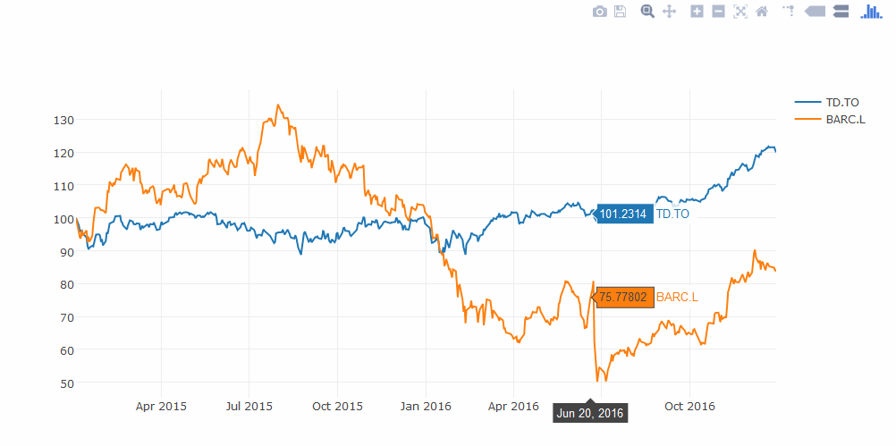

# Visualize performance of a domestic vs. foreign asset adjusted for exchange rate

This article demonstrates how a user can use Eikon Python API to quickly prototype and plot custom analytics which are not readily available within Eikon. The example shown here is one of the many use cases, that Quants/Analysts can employ to analyze financial data. 

### Eikon Python API
Thomson Reuters provides an ease of use python library for accessing market data, timeseries, fundamental and reference data and news. This Eikon library depends on **Eikon Scripting Proxy**, which runs with user's Eikon credentials, and provides data retrieval Web interface on top of which ease of use Python library is built.

For more information on Eikon Python API, please visit [Refinitiv Developers Portal](https://developers.refinitiv.com).

### Application Sample
The goal of this article is to demonstrate how easy it is to perform a simple analysis and plot it on a chart. This what-if analysis compares the return of a foreign asset against a domestic asset, if the same dollar amount was invested in both; taking into account the currency exchange rate during the comparison period. The term domestic is used loosely here and this approach can be used to compare any two assets, trading in any currencies. The sample accomplishes this by getting the trade currency of both the assets, and then requesting the calculated cross rate for this currency pair. Timeseries of price history for both assets are first expressed in units of domestic currency and then rebased to the start of the comparison period. The rebased data is then plotted on a line chart. 

The accompanying sample compares the performance of a Canadian bank - TD (TD.TO), trading on Toronto Stock Exchange in Canadian Dollars with British bank - Barclays (BARC.L), trading on London Stock Exchange in Pound Sterling.

### Dependencies
To try the code provided in this article, a setup and familiarity with following technologies is required:  
* Python language  
* JSON  
* Pandas Data Analysis library  
* Jupyter (iPython) Notebooks  
* Plotly (or Cufflinks) Charting library  

The code provided with this article was tested using python (3.6.1), eikon (0.1.7), numpy (1.12.1), pandas (0.20.1) and plotly (1.12.9)  
		
### Implementation
Following steps are executed to create the comparison chart:

1. Define domestic and foreign instruments and a time range for comparison. Since the performance data is normalized, any one of the two instruments can be considered as domestic and the other as foreign, and it will produce the same output.

2. Get the trading currency for both instruments. In this example we use "TR.CompanyMarketCap.Currency" field, which generally provides the currency of the main equity issue of the company on the main listing exchange.

	```python
	data,err = ek.get_data([instr1, instr2], "TR.CompanyMarketCap.Currency")
	```

3. Create a cross-currency exchange rate RIC and get historical data for the given time range. The cross rate is calculated by Thomson Reuters for most currency pairs. This RIC is formed by appending =R to both currencies. For e.g. Calculated cross rate RIC for CAD vs GBP would be "GBPCAD=R".

	```python
	crossRIC = data['Currency'][1] + data['Currency'][0] + '=R'
	curr = ek.get_timeseries([crossRIC], fields='CLOSE', start_date=start_date, end_date=end_date)
	```

4. Get historical data (CLOSE Price) for both instruments for requested time range.

5. Convert the price history of the foreign asset into domestic currency using the cross-currency rate we retrieved earlier. 

	```python
	# create a single DataFrame with both data series (useful if using cufflinks to plot instead of plotly)
	perf = pd.concat([perf1, perf2 * curr], axis=1)
	perf.columns = [instr1, instr2]
	# drop invalid entries from dataframe
	perf = perf.dropna()
	```

6. Rebase the data to the start of the time period, so that initial investment in both instruments shows up as 100%.

	```python
	# rebase both timeseries to 100% at start date
	perf_rb = perf * 100 / (perf[instr1][0], perf[instr2][0])
	```

7. Plot a double line chart. The two chart lines will show the % gain/loss on an investment in both instruments in domestic currency.

	```python
	# using offline plotly for charting
	offline.iplot([{
		'x': perf_rb.index,
		'y': perf_rb[col],
		'name': col
	}  for col in perf_rb.columns])	
	```

#### Simplification
The code sample above breaks the implementation into multiple steps for clarification and to show as an example, how various data and timeseries can be retrieved using Eikon API. A simple implementation of this code would be:
	
```python
# get and rebase the data
response, error = ek.get_data(instruments=[instr1, instr2], fields=['TR.ClosePrice.Date', 'TR.ClosePrice.Value'], 
	parameters={'Curn':'CAD','SDate':start_date,'EDate':end_date,'Frq':'D'})
df = response.pivot_table(values='Close Price', index=['Date', 'Instrument']).unstack('Instrument').dropna()
rebased = df.apply(lambda series: series/series[0]*100)

# plot it in a chart
offline.iplot([{
	'x': rebased.index,
	'y': rebased[column],
	'name': column[1]
}  for column in rebased.columns])
```
	
### Output
The resulting chart shows that an equal Canadian dollar amount invested in TD on Jan 2nd 2015 and liquidated on Jan 3rd 2017 would yield 21% gain vs. 15% loss on investment in Barclays, when factoring in the currency movement.

	
See the attached iPython notebook for complete working sample.	
	
### Related samples
Refinitiv [github samples repository](https://github.com/Refinitiv-API-Samples) has many more samples and snippets of code showing other uses of Eikon scripting API. Just search for python or EikonAPI within repositories.

### Reference
[Eikon Scripting API](https://developers.refinitiv.com/eikon-apis/eikon-web-and-scripting-apis-limited-access)   
[Pandas library](http://pandas.pydata.org/pandas-docs/stable/generated/pandas.DataFrame.html)   
[Plotly Charting](https://plot.ly/)   
